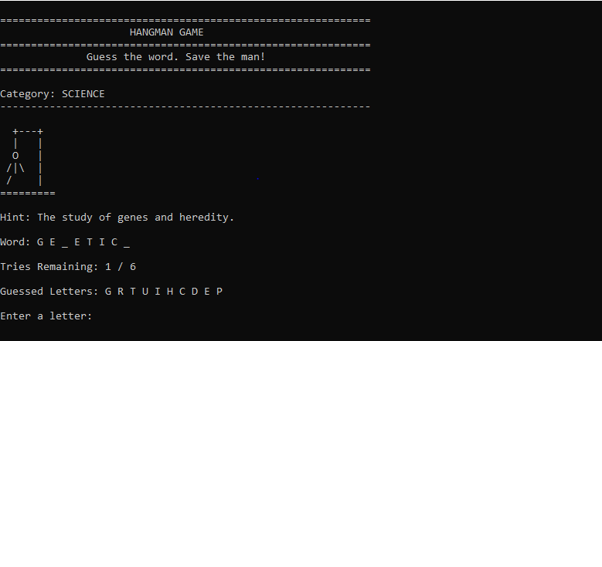

# Hangman Game in C

Hangman Game in C is a terminal-based word guessing game developed as a mini project to strengthen core programming concepts such as structures, arrays, functions, and modular program design. The player selects a category, guesses letters one at a time, and attempts to complete the hidden word before running out of tries.

- Developer: Anchal Jain
- Language: C
- Version: 1.0
- Available on GitHub

## Overview

The game presents the player with three word categories: Technology, Science, and Sports, each containing a set of words along with descriptive hints. Once a category is chosen, a word is selected at random and displayed as a series of blanks. The player guesses one letter at a time, and correct guesses reveal the corresponding positions in the word, while incorrect guesses reduce the number of remaining tries and progress an ASCII hangman drawing.

The program includes input validation to reject invalid characters and prevent the same letter from being guessed twice. A scoring system rewards ten points for every correct letter, with an additional fifty-point bonus for solving the word completely. At the end of each round, the game updates and displays session statistics including total score, wins, losses, and the player's current and best winning streaks, allowing multiple rounds to be played consecutively without restarting the program.

## How to Run

```
gcc Hangman.c -o hangman
./hangman
```

## Scoring

- Correct letter guessed: +10 points
- Word solved completely: +50 bonus points

## Output



```
============================================================
                     HANGMAN GAME
============================================================
              Guess the word. Save the man!
============================================================

Category: SCIENCE
------------------------------------------------------------

  +---+
  |   |
  O   |
 /|\  |
 /    |
=========

Hint: The study of genes and heredity.

Word: G E _ E T I C _
Tries Remaining: 1 / 6
Guessed Letters: G R T U I H C D E P

Enter a letter: 
```

## Author

Anchal Jain
